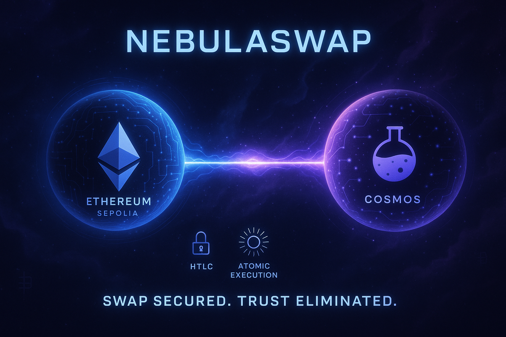

# NebulaSwap - Cross-Chain Atomic Swap Protocol



A trustless cross-chain atomic swap protocol enabling direct trading between Ethereum (Sepolia) and Cosmos (Osmosis) using Hash Time-Locked Contracts (HTLCs).

## 🚀 Overview

NebulaSwap implements bidirectional HTLC-based swaps between:
- **Sepolia ETH** ↔ **Osmosis Testnet ATOM**
- No trusted intermediaries or bridges required
- Atomic execution: either both sides succeed or both fail

## 🏗️ Architecture

### Core Components
- **Ethereum Contract**: `HtlcEth.sol` (Solidity) on Sepolia
- **Cosmos Contract**: CosmWasm contract (Rust) on Osmosis testnet
- **Relayer**: Node.js script monitoring and coordinating swaps
- **Frontend**: Next.js 14 app with dual wallet support

### Technology Stack
- **Blockchains**: Sepolia (Ethereum) + Osmosis (Cosmos)
- **Frontend**: Next.js, React, Tailwind CSS
- **Wallets**: MetaMask + Keplr
- **Contracts**: Solidity + CosmWasm (Rust)
- **Relayer**: Node.js, ethers.js, cosmjs

## 🔄 How It Works

1. **Setup**: User connects both wallets, selects tokens and amount
2. **Lock**: User locks ETH on Ethereum with hashlock
3. **Relay**: Relayer detects event and creates Cosmos HTLC
4. **Claim**: User claims ATOM on Cosmos by revealing secret
5. **Unlock**: Relayer uses revealed secret to unlock ETH
6. **Complete**: Both sides of the swap are executed atomically

## 🛠️ Development Status

This repository contains the architectural blueprint and implementation plan for the NebulaSwap MVP. The project is designed for a 72-hour hackathon implementation.

### Project Structure
```
nebula-swap/
├─ apps/
│  └─ frontend/            # Next.js 14 app
├─ contracts/
│  ├─ eth/                 # Solidity contracts
│  └─ cosmos/              # CosmWasm contracts
├─ packages/
│  └─ relayer/             # Node.js relayer script
└─ docs/                   # Documentation
```

## 🎯 Key Features

- **Atomic Execution**: Either both sides succeed or both fail
- **Bidirectional**: Supports both ETH→ATOM and ATOM→ETH swaps
- **Trustless**: No centralized authority or bridge required
- **Timeout Protection**: Refund mechanism after timelock expiry
- **Real-time Status**: Live transaction tracking in UI

## 📚 Documentation

- **PRD**: Product Requirements Document
- **Architecture**: Technical architecture and sequence diagrams
- **Implementation**: 72-hour action plan
- **App Flow**: User interaction documentation
- **Structure**: Project file organization

## 🚧 Getting Started

This is a planning repository. Implementation will follow the 72-hour action plan outlined in the documentation.

## 📄 License

MIT License - see LICENSE file for details.

## 🤝 Contributing

This is a hackathon project. Contributions and feedback are welcome!

---

**Note**: This project is designed for educational and demonstration purposes on testnets only. 